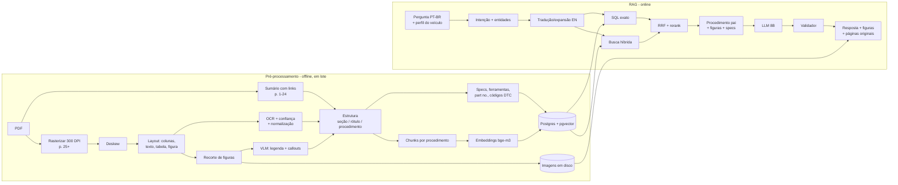

# Honda Civic — RAG de Manual de Serviço (v2)

Assistente local (Ollama, RTX A2000 8 GB) que responde perguntas de mecânicos a partir do manual de serviço Honda Civic 1992–1995, majoritariamente escaneado. Interface prioritária: PC.

> **v2**: revisado com as respostas às perguntas em aberto e com uma análise do PDF real (`data/raw/civic_1992-1995_service_manual.pdf`).

---

## 0. Decisões-chave

| Tema | Decisão | Por quê |
|---|---|---|
| Estrutura | **Usar o sumário com links do próprio PDF** (603 títulos → página) como esqueleto de seções e procedimentos | Já vem pronto nas páginas 1–24; evita adivinhar a hierarquia só pelo OCR. |
| OCR | **Tesseract 5 / PaddleOCR** para texto e tabelas, com confiança por palavra; **VLM só para figuras** e páginas de baixa confiança | Teste com Tesseract nas páginas reais já deu leitura quase perfeita de tabelas (scan 600 DPI). VLM é lenta com 8 GB e pode inventar números. |
| Unidade de indexação | **Procedimento** (Seção → Componente → Operação → Passos) | O mecânico precisa do procedimento inteiro com torques e figuras. |
| Busca | Densa + lexical (BM25) + **SQL exato** para specs, códigos e peças | Códigos como `08718-0001` ou `D16Z6` exigem busca exata. |
| Idioma | Pergunta PT-BR → tradução/expansão EN com glossário → resposta PT-BR | Manual em inglês. |
| Banco | PostgreSQL + pgvector + full-text (Docker) | Specs relacionais, vetores e BM25 com joins num só lugar. |
| Diagramas | Mostrar **o recorte original do scan**; VLM só descreve/indexa | Confiança do mecânico e zero risco de diagrama "inventado". |
| Segurança numérica | Validador pós-geração: todo número da resposta tem que existir no contexto | Torque errado quebra motor. |
| GPU 8 GB | **Um modelo por vez na GPU**; embeddings e reranker na CPU durante consultas | Não cabe VLM + LLM + embeddings juntos em 8 GB. |

---

## 1. O que o PDF real mostra

Análise feita em 20/09/2026 sobre o arquivo `Honda Civic 1995 Service Manual (1).pdf` (idêntico ao `Honda Civic 1995 Service Manual.pdf` que também está em Downloads).

### 1.1 Visão geral
- **1.458 páginas**, 108 MB, compilação do ManualsLib.
- **Páginas 1–24**: sumário do ManualsLib com **texto nativo e 603 links internos** (título → página do PDF). Já extraído para `data/meta/toc_links.json`.
- **Páginas 25+**: scans **600 DPI, 1-bit (preto e branco puro)**. Não precisa binarizar; basta deskew leve.
- Seções do sumário: Special Information (p. 26), General Information (27), Specifications (41), Maintenance (59), Engine (64), Intake/Exhaust (188), Cooling (197), Clutch (342), Brakes (680), Body (771), Electrical (935) etc. Os links chegam até a p. 935; o restante precisa ser estruturado pelo cabeçalho/rodapé das páginas.

### 1.2 Padrões das páginas (amostras vistas: PDF p. 42, 80, 88, 103)

| Página PDF | Rótulo | Tipo | O que importa |
|---|---|---|---|
| 42 | `3-2` | Tabela *Standards and Service Limits* | Linhas por variante de motor (D15B7, D15B8, D15Z1, D16Z6), IN/EX, coluna Standard vs Service Limit. Células mescladas → precisa de "fill-down". |
| 80 | `5-16` | Procedimento em **duas colunas**, passos 16–21, `(cont'd)` | Ordem de leitura por coluna. Torques dentro das figuras (`8 x 1.25 mm 22 N·m (2.2 kg-m, 16 lb-ft)`). |
| 88 | `6-3` | *Illustrated Index* (vista explodida) | CAUTION, NOTE, **`Part No. 08718-0001`**, torques e "Replace" nos callouts, referências cruzadas (`page 6-58`). |
| 103 | `6-18` | Fluxograma de troubleshooting VTEC | Código de pisca `CODE 21`, caixas sim/não, `To page 6-19` (continua na próxima página). |

- **Rótulo da página** (`6-3`) no rodapé, canto externo. É a referência de citação que o mecânico conhece.
- **Unidades deste manual**: `N·m (kg-m, lb-ft)`, e não `kgf·m`. Folgas em `mm (in)`.
- **O próprio manual tem erros de digitação** (ex.: cam lobe D15B8 IN `39.057 (1.4196)`: mm e polegadas não batem). O sistema cita o manual; não "corrige" silenciosamente. Pode sinalizar incoerências mm × in para revisão.

### 1.3 Teste rápido de OCR (Tesseract 5.3, 300 DPI, sem ajuste)
- Tabela da p. 42: praticamente todos os números corretos. Erros típicos: `D1i5B8` em vez de `D15B8`, barras de tabela lidas como `|`, travessões variados.
- Página 88: texto e callouts lidos, com erros sistemáticos corrigíveis: `N·m` → `Nem`, `lb-ft` → `Ib-ft`, `•` → `@`. O traço dos desenhos gera lixo (`eS`, `ZF.`, `S»`), que precisa ser filtrado pela região de layout e pela confiança.
- Conclusão: **OCR clássico é suficiente para o texto**; o problema real é layout (colunas, figuras) e normalização, não reconhecimento.

### 1.4 Escopo de motores: ponto de atenção
- Este manual cobre **D15B7, D15B8, D15Z1 e D16Z6** (Civic 1992–1995).
- **D16Y7 e D16Y8 não estão neste manual**: são motores da geração seguinte (Civic 1996–2000), que tem outro manual de serviço.
- Plano: começar com **D16Z6** como motor prioritário. O banco já nasce multi-manual (`documents.model_years` + `applicability`), então o manual 1996–2000 entra depois pelo mesmo pipeline, e o filtro de veículo decide qual manual responde.

### 1.5 Catálogo de peças: ponto de atenção
- O arquivo indicado como catálogo é o **manual de serviço** (mesmo arquivo). Não há catálogo de peças por enquanto.
- O manual traz alguns números Honda (ex.: `Part No. 08718-0001`, selante líquido) e números de ferramentas especiais (`07xxx-xxxxxxx`). Esses entram na fase 3.
- Os códigos OEM de peças mecânicas (formato `12345-ABC-A01`) dependem de um catálogo. A tabela `part_numbers` fica pronta, com `source`, para quando houver uma fonte.

---

## 2. Orçamento de GPU (RTX A2000, 8 GB)

| Uso | Modelo sugerido (Ollama) | VRAM aprox. (Q4) | Onde roda |
|---|---|---|---|
| VLM (figuras, ingestão) | `qwen2.5vl:7b` (alternativas: `qwen3-vl:8b` se disponível, `gemma3:4b` mais leve) | ~6 GB | GPU, **só durante a ingestão** |
| LLM (respostas) | `qwen3:8b` ou `llama3.1:8b`, `num_ctx` 8192 | ~5–6 GB com contexto | GPU |
| Classificação de intenção/tradução | o mesmo LLM (evita troca de modelo) | — | GPU |
| Embeddings | `bge-m3` (multilíngue, 1024 dim) | ~1.2 GB | GPU na ingestão; **CPU nas consultas** (`num_gpu: 0`) |
| Reranker | `bge-reranker-v2-m3` (Python, fora do Ollama) | — | CPU (20 pares ≈ 1–3 s) |
| Layout + OCR | Docling / PaddleOCR / Tesseract | pouco ou nada | CPU ou GPU entre etapas |

Configuração do Ollama no Windows (variáveis de ambiente):
```
OLLAMA_MAX_LOADED_MODELS=1
OLLAMA_FLASH_ATTENTION=1
OLLAMA_KV_CACHE_TYPE=q8_0      # reduz a memória do contexto
```
- Modelos de 12–14B não cabem com contexto útil em 8 GB; ficar em 7–8B.
- A ingestão roda **por etapa em lote** (todo o OCR, depois todas as figuras na VLM, depois todos os embeddings) para não ficar trocando de modelo na GPU.
- Se o `qwen3:8b` for usado, desativar o modo "thinking" na geração final (mais rápido, e o validador já faz a checagem).

---

## 3. Visão geral da arquitetura



---

## 4. Pré-processamento (PDF → OCR → embeddings)

Cada etapa grava o resultado por página em `data/pages/{pdf_page}/`. O pipeline é **idempotente e retomável** (`--stage`, `--pages`).

### 4.1 Sumário (p. 1–24, texto nativo)
- Já feito: `data/meta/toc_links.json` com 603 entradas `{order, title, pdf_page}`.
- Usar para: criar `sections` e `procedures` candidatos, e delimitar o intervalo de páginas de cada título (vai até o próximo título).
- Complementar com o cabeçalho das páginas escaneadas (título grande + `(cont'd)`) para páginas depois da 935 e para subdivisões que o sumário não lista.

### 4.2 Rasterização e limpeza
- `PyMuPDF` ou `pdftoppm`: 300 DPI em tons de cinza para OCR (o anti-aliasing do 1-bit → cinza ajuda o OCR); 150 DPI WebP para exibição.
- Deskew leve; detecção de páginas giradas (tabelas deitadas). Sem binarização (o scan já é 1-bit).

### 4.3 Layout
Regiões: `title`, `text`, `list`, `table`, `figure`, `caption`, `page_label`.
- **Ordem de leitura em duas colunas** é obrigatória (páginas de procedimento como a 5-16).
- Candidatos: **Docling** (layout + tabelas, integra Tesseract/RapidOCR), **PaddleOCR PP-Structure / PP-DocLayout**.
- Texto dentro de `figure` é OCRizado à parte como **callouts** (com bbox), não misturado ao texto corrido.

### 4.4 OCR e normalização
- OCR clássico em todas as regiões, com confiança por palavra.
- **Dicionário de normalização** específico do manual (aplicado com cuidado, por regex com contexto):

| OCR | Correto |
|---|---|
| `Nem`, `N*m`, `N-m`, `Nm` | `N·m` |
| `Ib-ft`, `1b-ft` | `lb-ft` |
| `kg-rn`, `kg—m` | `kg-m` |
| `D1i5B8`, `Dl6Z6`, `D16 Z6` | `D15B8`, `D16Z6` (lista fechada de códigos válidos) |
| `@` no início de item | `•` |
| `—` entre números | `-` (faixa) |

- Filtro de lixo nas figuras: descartar tokens com confiança baixa e sem padrão reconhecível (maiúsculas, números, unidades).
- **Conciliação de números**: onde houver VLM e OCR na mesma região (figuras, páginas ruins), divergência em número → `review_queue`.
- Validação de tabelas: coerência mm × polegadas (1 in = 25.4 mm); incoerência → `review_queue` com a flag "possível erro do próprio manual".

### 4.5 Estrutura
- `page_label` (`6-3`) pelo rodapé, validado pela sequência (se a página anterior é `6-2`, esta deve ser `6-3`).
- Títulos e operações (`Removal`, `Installation`, `Inspection`, `Adjustment`, `Replacement`, `Illustrated Index`, `Troubleshooting Flowchart`).
- Passos numerados → `steps[]`, com `NOTE`, `CAUTION`, `WARNING` e referências (`page 6-58`, `see step 5`).
- Junção de procedimentos que continuam (`(cont'd)`, `To page 6-19`).
- **Variante**: rótulos como `D16Z6 engine:`, `(D16Z6, D15Z1 engine)`, `M/T`, `A/T` alimentam `applicability`.

### 4.6 Extração estruturada

| Tipo | Padrão (após normalização) | Destino |
|---|---|---|
| Torque | `\d+(\.\d+)?\s*N·m\s*\(\s*[\d.]+\s*kg-m,\s*[\d.]+\s*lb-ft\)` | `specs` |
| Rosca | `\d+\s*x\s*\d+(\.\d+)?\s*mm` | `specs.fastener` |
| Folga/limite | tabelas *Standard (New)* / *Service Limit*, `mm (in)` | `specs` |
| Ferramenta especial | `07[A-Z0-9]{3}-[A-Z0-9]{6,7}` | `special_tools` |
| Nº de peça/produto no manual | `Part No\.?\s*(\d{5}-\d{4}\|\d{5}-[A-Z0-9]{3}-[A-Z0-9]{2,4})` | `part_numbers` |
| Código de motor | lista fechada: `D15B7`, `D15B8`, `D15Z1`, `D16Z6` (+ D16Y7/D16Y8 no manual 96–00) | `applicability` |
| Código de diagnóstico | `CODE\s+(\d{1,2})` | `dtc_codes` |
| Consumíveis/avisos | `Replace`, `liquid gasket`, `engine oil`, `grease` | `procedures.consumables` |

### 4.7 Chunking
- **Filho** (indexado): trechos de ~300–500 tokens sem quebrar passos, com prefixo de contexto:
  `[Seção 6 Cylinder Head/Valve Train · Illustrated Index · D16Z6 · p. 6-3]`
- **Pai** (enviado ao LLM): procedimento completo com specs e figuras vinculadas.
- Chunks próprios para cada tabela de specs (uma linha por componente + variante, em texto) e para cada figura (legenda + callouts).
- Contexto do LLM é de 8k tokens: a expansão para o pai tem limite de tamanho (procedimentos longos entram só com os passos relevantes + specs).

### 4.8 Embeddings
- `bge-m3` via Ollama; guardar `embedding_model` para reindexar se trocar.

---

## 5. Pipeline RAG (query → recuperação → geração)

### 5.1 Perfil do veículo (UI)
Motor (padrão **D16Z6**), transmissão (M/T ou A/T), carroceria. Vira filtro de `applicability` e escolhe o manual certo quando houver mais de um.

### 5.2 Etapas
1. **Intenção + entidades** (LLM, JSON): `procedure` | `spec` | `part_number` | `special_tool` | `diagram` | `troubleshooting` | `dtc` | `general`; componente, operação, motor, códigos.
2. **Tradução/expansão PT→EN** com `glossary_pt_en` ("correia dentada" → *timing belt*; "tampa de válvulas" → *cylinder head cover*; "junta do cabeçote" → *cylinder head gasket*; "folga de válvulas" → *valve clearance*; "luz da injeção piscando" → *Check Engine light / self-diagnosis code*). 2–3 variações.
3. **Roteamento**: `spec`, `part_number`, `special_tool`, `dtc` → SQL primeiro; `procedure`, `troubleshooting` → busca híbrida com filtros; `diagram` → `figures`.
4. **Busca híbrida**: pgvector (cosseno) + full-text Postgres → RRF.
5. **Rerank** dos top-20 com `bge-reranker-v2-m3` na CPU (fase 2 pode começar sem e medir).
6. **Expansão**: procedimento pai, specs, figuras, ferramentas especiais da seção.
7. **Geração**: LLM 8B, temperatura 0–0.2.
8. **Validação**: todo número com unidade e todo código da resposta aparece literalmente no contexto; toda citação `[p. 6-3]` existe no contexto; senão, remove e sinaliza. Sem contexto suficiente → "não encontrado no manual" + páginas mais próximas.

### 5.3 Prompt de sistema (esboço)
```
Você é um assistente técnico para mecânicos, baseado EXCLUSIVAMENTE no manual de
serviço Honda Civic fornecido no CONTEXTO.
- Responda em português do Brasil; mantenha o termo original em inglês entre
  parênteses na primeira ocorrência: "tampa do cabeçote (cylinder head cover)".
- Copie torques, folgas e códigos EXATAMENTE como no contexto, com todas as
  unidades (N·m, kg-m, lb-ft, mm, in).
- Nunca invente valores. Se faltar, diga "não consta no trecho recuperado".
- Cite a página do manual ao lado de cada informação: [p. 6-3].
- Indique a qual motor/transmissão cada dado se aplica.
- Destaque CAUTION/WARNING do manual.
```

### 5.4 Formato de resposta (procedimento)
```
## Remoção da tampa do cabeçote — D16Z6            Fontes: p. 6-3, 6-…
⚠️ Avisos           CAUTION: esperar o líquido de arrefecimento < 38 °C (100 °F) [p. 6-3]
🔧 Ferramentas      ...
🧩 Substituir       O-rings e juntas; selante líquido Part No. 08718-0001 [p. 6-3]
📏 Torques          | Fixador | Rosca | Torque | Página |
📋 Passo a passo    1. ...
🖼️ Figuras          [recorte da vista explodida] [ver página 6-3]
```

---

## 6. Estratégia para diagramas e imagens

Princípio: **recuperar e exibir a imagem original; nunca gerar diagrama.**

1. **Extração**: recorte das regiões `figure` (com margem) em PNG a partir do render de 300 DPI; página inteira em 150 DPI para "ver página".
2. **Tipo**: `exploded_view` (p. 6-3), `procedure_illustration` (p. 5-16), `flowchart` (p. 6-18), `wiring_diagram`, `table_image`.
3. **Enriquecimento**:
   - Todos: callouts do OCR (texto + bbox) + legenda curta da VLM.
   - Vista explodida: VLM extrai `{label, fastener, torque, note}` por callout; torques conciliados com o OCR.
   - Ilustração de procedimento: vínculo com o passo pela posição na coluna (a figura logo abaixo do passo 16 pertence ao passo 16).
   - Fluxograma: converter para texto estruturado (nós, perguntas sim/não, destino `To page 6-19`) e juntar as páginas. O OCR clássico lê bem as caixas; a VLM ajuda com as setas. Revisar à mão os mais usados.
   - Diagrama elétrico: fase posterior (cores de fio, conectores).
4. **Vínculo figura ↔ texto** (`chunk_figures`): mesma página/coluna, referência explícita, casamento de callouts.
5. **Busca**: legenda + callouts no índice híbrido. Opcional depois: busca visual por página com ColPali/ColQwen (verificar se cabe em 8 GB ao lado do resto; rodaria só na ingestão + CPU na consulta, ou ficaria de fora).
6. **Exibição**: recortes na resposta com destaque (bbox) no callout citado e botão para a página inteira.

---

## 7. Banco de dados e índices

PostgreSQL 16 + `pgvector` + `pg_trgm` (Docker Desktop). Imagens em disco.

```sql
CREATE TABLE documents (
  id            SERIAL PRIMARY KEY,
  title         TEXT NOT NULL,
  doc_type      TEXT NOT NULL,          -- 'service_manual' | 'parts_catalog'
  model_years   INT4RANGE,              -- [1992,1996)
  engines       TEXT[],                 -- {D15B7,D15B8,D15Z1,D16Z6}
  file_path     TEXT NOT NULL,
  file_sha256   TEXT NOT NULL UNIQUE
);

CREATE TABLE sections (
  id            SERIAL PRIMARY KEY,
  document_id   INT REFERENCES documents(id),
  number        TEXT,                   -- '6'
  title         TEXT NOT NULL,          -- 'Cylinder Head/Valve Train'
  pdf_page_start INT, pdf_page_end INT
);

CREATE TABLE toc_entries (               -- vindo de toc_links.json
  id            SERIAL PRIMARY KEY,
  document_id   INT REFERENCES documents(id),
  ord           INT NOT NULL,
  title         TEXT NOT NULL,
  pdf_page      INT NOT NULL,
  section_id    INT REFERENCES sections(id)
);

CREATE TABLE pages (
  id              SERIAL PRIMARY KEY,
  document_id     INT REFERENCES documents(id),
  pdf_page        INT NOT NULL,
  page_label      TEXT,                 -- '6-3' (citação)
  section_id      INT REFERENCES sections(id),
  image_path      TEXT NOT NULL,
  ocr_text        TEXT,
  ocr_engine      TEXT,
  ocr_confidence  REAL,
  layout_json     JSONB,
  needs_review    BOOLEAN DEFAULT FALSE,
  UNIQUE (document_id, pdf_page)
);

CREATE TABLE procedures (
  id              SERIAL PRIMARY KEY,
  section_id      INT REFERENCES sections(id),
  toc_entry_id    INT REFERENCES toc_entries(id),
  component       TEXT NOT NULL,
  procedure_type  TEXT NOT NULL,        -- removal|installation|inspection|adjustment|
                                        -- replacement|illustrated_index|troubleshooting|specs
  title           TEXT NOT NULL,
  steps           JSONB,                -- [{n, text, notes[], figure_ids[]}]
  warnings        TEXT[],
  consumables     TEXT[],
  applicability   JSONB,                -- {"engine":["D16Z6"],"trans":["MT","AT"]}
  page_labels     TEXT[],
  full_text       TEXT NOT NULL
);

CREATE TABLE chunks (
  id              SERIAL PRIMARY KEY,
  procedure_id    INT REFERENCES procedures(id),
  chunk_type      TEXT NOT NULL,        -- procedure|spec_table|figure|flowchart|text
  text            TEXT NOT NULL,
  page_labels     TEXT[] NOT NULL,
  applicability   JSONB,
  embedding       VECTOR(1024),
  embedding_model TEXT NOT NULL,
  tsv             TSVECTOR GENERATED ALWAYS AS (to_tsvector('english', text)) STORED
);
CREATE INDEX ON chunks USING hnsw (embedding vector_cosine_ops);
CREATE INDEX ON chunks USING gin (tsv);
CREATE INDEX ON chunks USING gin (applicability);

CREATE TABLE figures (
  id              SERIAL PRIMARY KEY,
  page_id         INT REFERENCES pages(id),
  bbox            INT[4],
  image_path      TEXT NOT NULL,
  figure_type     TEXT,
  caption         TEXT,
  callouts        JSONB,                -- [{label, fastener, torque, note, bbox}]
  structured      JSONB                 -- fluxograma convertido etc.
);

CREATE TABLE chunk_figures (
  chunk_id   INT REFERENCES chunks(id),
  figure_id  INT REFERENCES figures(id),
  link_type  TEXT,                      -- same_page|same_column|referenced|callout_match
  PRIMARY KEY (chunk_id, figure_id)
);

CREATE TABLE specs (
  id              SERIAL PRIMARY KEY,
  component       TEXT NOT NULL,        -- 'Cylinder head bolts'
  parameter       TEXT NOT NULL,        -- torque|clearance|standard|service_limit|height...
  value_text      TEXT NOT NULL,        -- literal: '73 N·m (7.3 kg-m, 53 lb-ft)'
  value_min       NUMERIC, value_max NUMERIC,
  unit            TEXT,
  fastener        TEXT,                 -- '10 x 1.25 mm'
  side            TEXT,                 -- IN|EX|NULL
  conditions      TEXT,
  applicability   JSONB,
  page_id         INT REFERENCES pages(id),
  figure_id       INT REFERENCES figures(id),
  procedure_id    INT REFERENCES procedures(id),
  source_engine   TEXT,                 -- ocr|vlm|both|manual
  verified        BOOLEAN DEFAULT FALSE
);
CREATE INDEX ON specs USING gin (component gin_trgm_ops);

CREATE TABLE special_tools (
  tool_number   TEXT PRIMARY KEY,
  name          TEXT,
  section_id    INT REFERENCES sections(id),
  page_id       INT REFERENCES pages(id),
  figure_id     INT REFERENCES figures(id)
);

CREATE TABLE part_numbers (
  id            SERIAL PRIMARY KEY,
  part_number   TEXT NOT NULL,          -- '08718-0001'
  description   TEXT,                   -- 'liquid gasket'
  ref_number    TEXT,                   -- nº no diagrama do catálogo (futuro)
  applicability JSONB,
  document_id   INT REFERENCES documents(id),
  page_id       INT REFERENCES pages(id),
  figure_id     INT REFERENCES figures(id),
  verified      BOOLEAN DEFAULT FALSE
);
CREATE INDEX ON part_numbers (part_number);

CREATE TABLE dtc_codes (
  code          TEXT NOT NULL,          -- '21'
  system        TEXT,                   -- 'VTEC spool valve'
  description   TEXT,
  procedure_id  INT REFERENCES procedures(id),
  document_id   INT REFERENCES documents(id),
  PRIMARY KEY (document_id, code)
);

CREATE TABLE glossary_pt_en (term_pt TEXT PRIMARY KEY, term_en TEXT[] NOT NULL);

CREATE TABLE review_queue (
  id          SERIAL PRIMARY KEY,
  item_type   TEXT,                     -- spec|page|part_number|figure|table
  item_id     INT,
  reason      TEXT,                     -- ocr_vlm_mismatch|low_conf|unit_mismatch
  candidates  JSONB,
  resolved    BOOLEAN DEFAULT FALSE
);

CREATE TABLE eval_questions (
  id              SERIAL PRIMARY KEY,
  question_pt     TEXT NOT NULL,
  intent          TEXT,
  engine          TEXT,
  expected_pages  TEXT[],
  expected_values TEXT[]
);
```

---

## 8. Stack e repositório

| Camada | Escolha |
|---|---|
| Linguagem | Python 3.11+ |
| PDF | PyMuPDF (render + texto nativo + links do sumário) |
| Imagem | OpenCV, Pillow |
| Layout + OCR | Docling com Tesseract **ou** PaddleOCR (decidido na Fase 0) |
| LLM / VLM / embeddings | Ollama no Windows |
| Reranker | `FlagEmbedding` na CPU |
| Banco | PostgreSQL 16 + pgvector (Docker Desktop) |
| API | FastAPI |
| UI | **Streamlit** local no PC (imagens, tabelas e perfil do veículo são simples) |

> Windows: Tesseract pelo instalador UB-Mannheim; PaddleOCR com GPU tende a ser mais fácil via WSL2. Ollama e Streamlit rodam nativos.

```
honda-rag/
├── PLAN.md
├── docker-compose.yml
├── pyproject.toml
├── .env.example                # OLLAMA_HOST, modelos, DB_URL, limiares
├── data/                       # fora do git
│   ├── raw/civic_1992-1995_service_manual.pdf   ✅ já copiado
│   ├── meta/toc_links.json                       ✅ já extraído
│   ├── pages/{pdf_page}/       # page.png, view.webp, layout.json, ocr.json, vlm.json
│   ├── figures/
│   └── ground_truth/           # páginas transcritas à mão
├── src/honda_rag/
│   ├── config.py
│   ├── ingest/  (toc.py, rasterize.py, layout.py, ocr.py, normalize.py, vlm.py,
│   │             reconcile.py, structure.py, extract.py, chunk.py, embed.py, run.py)
│   ├── db/      (schema.sql, repo.py)
│   ├── retrieval/ (intent.py, translate.py, sql_lookup.py, hybrid.py, rerank.py, expand.py)
│   ├── generation/ (prompts.py, generate.py, validate.py)
│   ├── api/main.py
│   └── ui/app.py
├── tools/ (review_app.py, ocr_benchmark.py)
└── eval/  (questions.yaml, run_eval.py)
```

---

## 9. Piloto: primeiras 100 páginas

O que tem nas páginas 1–100 do PDF:

| Páginas PDF | Conteúdo | Tratamento |
|---|---|---|
| 1–24 | Sumário ManualsLib (texto nativo, links) | ✅ já extraído, sem OCR |
| 25–40 | Special/General Information, identificação, elevação, reboque, ferramentas especiais | OCR |
| 41–58 | **Specifications** (seção 3): Standards and Service Limits, Design Specifications | OCR + parser de tabela → `specs` (**alto valor**) |
| 59–63 | Maintenance: pontos de lubrificação, plano de manutenção | OCR + tabela |
| 64–85 | Engine: descrição do VTEC, **Engine Removal/Installation** (duas colunas), suportes | OCR + layout 2 colunas + figuras |
| 86–100 | Cylinder Head/Valve Train: **Illustrated Index** (vistas explodidas), conectores VTEC, início do diagnóstico | OCR + callouts + VLM |

Sugestão: estender o piloto até a **p. 110** para incluir um fluxograma completo (VTEC, p. 102–107) e um procedimento curto (Valve Seals, p. 109). Assim o piloto cobre os 4 tipos de página.

**Estimativa de tempo no seu hardware** (medir na Fase 0): OCR ~3–6 s/página na CPU → ~10 min para 86 páginas; VLM ~20–40 s por figura → 1–2 h para as figuras do piloto; embeddings: minutos. Extrapolando, o manual completo leva uma noite de processamento.

**Páginas de referência para o benchmark** (transcrever à mão): 42 (tabela), 44 (tabela), 62 (plano de manutenção), 67 (specs do D16Z6), 80 (procedimento 2 colunas), 82, 88 (vista explodida), 90, 97 (diagnóstico), 103 (fluxograma). Mais 10 páginas sorteadas.

**Perguntas de avaliação iniciais** (exemplos que o piloto deve responder):
- "Qual o torque dos parafusos do cabeçote do D16Z6?" → `73 N·m (7.3 kg-m, 53 lb-ft)`, p. 6-3
- "Folga de válvulas de admissão e escape?" → IN `0.18-0.22 mm`, EX `0.23-0.27 mm`, p. 3-2
- "Altura do cabeçote D16Z6 e limite de empeno?" → `92.95-93.05 mm`, empeno limite `0.05 mm`, p. 3-2
- "Qual o selante líquido indicado na montagem do cabeçote?" → liquid gasket `Part No. 08718-0001`, p. 6-3
- "Como tirar a bomba da direção hidráulica na remoção do motor?" → passo 20, p. 5-16
- "Código 21 piscando, o que é?" → spool valve VTEC, p. 6-18 (se o piloto for até a p. 110)

---

## 10. Avaliação
- **OCR**: CER e **% de números corretos** nas páginas de referência (meta ≥ 98% dos números antes da revisão; 100% depois).
- **Recuperação**: recall@5 e MRR sobre `eval_questions`.
- **Geração**: exatidão numérica, citação correta, recusa correta para perguntas fora do manual ou do motor (ex.: pergunta sobre D16Y8 → "não coberto por este manual").
- Rodar `eval/run_eval.py` a cada mudança de modelo, prompt ou chunking.

---

## 11. Roadmap

| Fase | Entrega | Critério de pronto |
|---|---|---|
| **0 — Benchmark** (p. 1–110) | Ambiente (Ollama, Docker/Postgres, Tesseract); páginas de referência; Tesseract × PaddleOCR × Docling; `qwen2.5vl:7b` × `gemma3:4b` nas figuras; tempos medidos | Motor de OCR escolhido; ≥ 98% dos números corretos |
| **1 — Ingestão do piloto** | Sumário → seções; OCR + normalização; layout 2 colunas; `page_label`; chunks; embeddings | Todas as páginas com rótulo; procedimentos do piloto montados |
| **2 — RAG de texto** | Busca híbrida, geração, validador; CLI | Perguntas da seção 9 corretas; zero número inventado |
| **3 — Dados estruturados** | Specs das p. 41–58 e dos Illustrated Index; ferramentas especiais; part numbers do manual; DTC; app de revisão | Specs do D16Z6 do piloto 100% verificadas |
| **4 — Figuras** | Recortes, callouts, legendas VLM, vínculo com passos; exibição na UI | Perguntas de procedimento trazem a figura certa em ≥ 80% |
| **5 — UI Streamlit** | Perfil do veículo, chat, figuras, "ver página" | Uso no PC da oficina |
| **6 — Manual completo** | Ingestão das 1.458 páginas em lote noturno | Eval completo verde |
| **7 — Expansões** | Manual 1996–2000 (D16Y7/D16Y8); catálogo de peças; diagramas elétricos | — |

---

## 12. Riscos e mitigação

| Risco | Mitigação |
|---|---|
| Número errado (OCR, VLM ou alucinação) | Normalização + conciliação + fila de revisão + validador + página original sempre visível |
| Erros do próprio manual | Checagem mm × in; citar, nunca corrigir em silêncio |
| Spec do motor errado | Perfil do veículo + `applicability`; recusa explícita para motores fora do manual |
| Layout 2 colunas lido fora de ordem | Detector de layout + teste nas páginas 5-x |
| 8 GB de VRAM | Um modelo por vez, modelos 7–8B Q4, embeddings/reranker na CPU, KV cache q8 |
| Sem catálogo de peças | Part numbers do manual agora; tabela pronta para catálogo |
| Direitos autorais | Uso pessoal; não publicar índice nem imagens |

---

## 13. Pendências
1. **D16Y7/D16Y8**: conseguir o manual de serviço Civic 1996–2000, se esses motores forem necessários.
2. **Catálogo de peças**: localizar um arquivo de catálogo (o PDF indicado é o manual de serviço).
3. Confirmar se o piloto pode ir até a p. 110 (para incluir um fluxograma completo).
